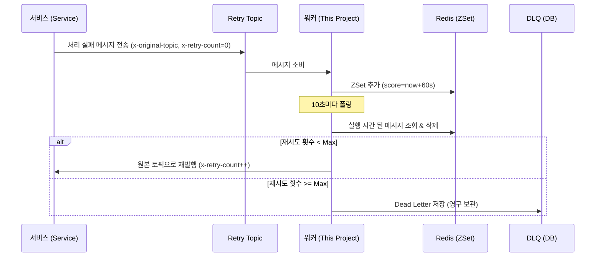

#### Kafka 메시지 소비 실패한 경우 장애를 격리하고 안정적으로 재처리하기 위한 중앙 집중형 **Retry Worker** 서비스

- **중앙 집중 처리**: 각 서비스가 개별적으로 재시도 로직을 구현할 필요 없이 이 워커가 모든 재처리 토픽(`common-retry-topic`)을 통합 구독하여 재발행
- **정확한 지연**: Redis ZSet을 활용하여 설정된 지연 시간을 정확히 준수하여 원본 토픽으로 재발행
- **장애 격리**: 메시지 처리 실패 시 즉시 Retry 토픽으로 격리하여 원본 파티션의 Lag 발생을 방지하고 서비스 안정성을 확보
- **DLQ 자동 격리**: 최대 재시도 횟수(3회)를 초과한 메시지는 DB(`kafka_dead_letters` table)에 영구 저장하여 유실을 방지하고 추후 분석/재처리를 지원
- **Admin API**: 적재된 Dead Letter 메시지를 조회하거나 수동으로 재발행, 또는 Redis 대기열을 관리할 수 있는 Admin API 를 제공

---

### 🚀 퀵 스타트

#### 1. Gradle 의존성 추가
프로젝트의 `build.gradle` 파일에 아래 의존성을 추가   
(관련 레포지토리: https://github.com/1-sanghyeondong/common-kafka)

```gradle
dependencies {
    implementation 'com.common:common-kafka:1.0.0'
}
```

#### 2. application.yml 설정
운영 환경에 맞게 토픽 구독 패턴 및 지연 정책을 설정합니다.

```yaml
spring:
  kafka:
    bootstrap-servers: 카프카 브로커 주소 (입력하지 않으면 앱 구동 실패)
```

---

##### 상세 기능
각 서비스(Producer)에서 처리에 실패한 메시지는 `common-retry-topic` 토픽으로 발행됩니다. 이 워커는 해당 메시지를 소비하여 다음과 같이 처리합니다.

1.  **Consume**: Retry 토픽에서 메시지를 읽습니다.
2.  **Enqueue**: Redis ZSet(`platform:retry:queue`)에 `score = 현재시간 + delayMs`로 저장합니다.
3.  **Polling**: 10초 주기(`@Scheduled`)로 Redis를 폴링하여 재발행 시점이 된 메시지를 조회합니다.
4.  **Resend**:
    *   **재시도 횟수 미만**: `x-retry-count` 헤더를 증가시키고 원본 토픽(`x-original-topic`)으로 재발행합니다.
    *   **재시도 횟수 초과**: 더 이상 재시도하지 않고 `kafka_dead_letters` 테이블(DLQ)에 저장합니다.




#### 🛡️ Resiliency & Fail-Safe
- **Zero Data Loss**: 메시지 처리가 완전히 완료된 후에만 `ack.acknowledge()`를 호출하여 장애 시 메시지 유실을 원천 차단합니다.
- **Header Preservation**: 재처리 과정에서도 Trace ID 등 원본 헤더를 보존하며, 추가로 `x-dlq-reason` 등을 포함하여 디버깅을 지원합니다.
- **Fail-Safe Headers**: `platform-kafka-common` 라이브러리와 상수를 공유하여 휴먼 에러로 인한 헤더 키 불일치를 방지합니다.

##### Admin API
운영 중 발생한 Dead Letter 메시지를 관리하기 위한 REST API를 제공합니다.

| Method | URI | 설명 |
|---|---|---|
| `GET` | `/api/messages` | DLQ(Dead Letter) 메시지 목록 조회 (페이징, 필터링 지원) |
| `POST` | `/api/messages/resend` | DLQ에 저장된 메시지를 원본 토픽으로 재발행 (startId ~ endId 범위) |
| `DELETE` | `/api/messages/retry-queue` | Redis Retry 대기열의 메시지 삭제 (전체 또는 특정 Key) |
