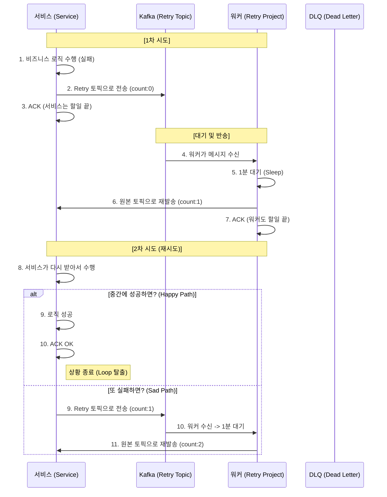

#### Kafka 실패 메시지를 중앙에서 관리하고 재처리(Retry)하는 Kafka DeadLetter Queue 서비스
- **중앙 집중형 관리 (Centralized)**: 각 서비스가 개별적으로 재시도 로직을 구현할 필요 없이 이 워커 하나가 모든 `*-retry-1m` 토픽을 통합 구독하여 처리
- **정밀한 지연 처리 (Smart Delay)**: 메시지 헤더 분석을 통해 설정된 시간(예: 1분)을 정확히 준수하여 재발행함으로써 시스템 부하를 분산하고 복구 시간을 확보
- **신뢰성 있는 실패 관리 (DLQ)**: 최대 재시도 횟수 초과 시 자동으로 DLQ(Dead Letter Queue)로 격리하여 데이터 유실을 방지하고 실패 원인 추적 지원

---

### 🚀 퀵 스타트

#### 1. Gradle 의존성 추가
프로젝트의 `build.gradle` 파일에 아래 의존성을 추가   
(관련 레포지토리: https://github.com/1-sanghyeondong/common-kafka)

```gradle
dependencies {
    implementation 'com.common:common-kafka:1.0.0'
}
```

#### 2. application.yml 설정
운영 환경에 맞게 토픽 구독 패턴 및 지연 정책을 설정합니다.

```yaml
spring:
  kafka:
    consumer:
      properties:
        metadata.max.age.ms: 10000   # 새로운 Retry 토픽 자동 감지 주기
      enable-auto-commit: false      # 수동 커밋 모드 (안정성 확보)

retry:
  worker:
    topic-pattern: ".*-retry-1m"     # 구독할 토픽 정규식
    delay-ms: 60000                  # 재시도 대기 시간 (1분)
    max-retry-count: 2               # 최대 재시도 횟수
    dlq-suffix: "-dlq"               # 실패 시 격리 토픽 접미사
    concurrency: 3                   # 병렬 리스너 개수 (기본값 3)
```

---

### 상세 기능

#### 1. 패턴 구독 기반 중앙 관리 (Pattern Subscription)
특정 토픽을 명시하지 않아도 `topic-pattern`에 매칭되는 모든 토픽을 동적으로 감지하여 리스닝합니다.
- **장점**: 새로운 마이크로서비스가 추가되어도 워커의 재배포 없이 자동으로 재시도 처리 대상에 포함됩니다.

#### 2. 스마트 지연 매커니즘 (Smart Delay)
메시지가 워커에 도달했을 때, 즉시 재전송하지 않고 헤더(`x-forwarded-at`)를 기반으로 지연 시간을 계산합니다.
- **동작**: 설정된 1분이 아직 경과하지 않았다면 남은 시간만큼 `Thread.sleep()`을 수행하여 정확한 타임라인을 보장합니다.

#### 3. 고도화된 격리 및 복구 flow
메시지의 상태에 따라 원본 토픽으로 재발행하거나 DLQ로 격리합니다.



#### 🛡️ Resiliency & Fail-Safe
- **Zero Data Loss**: 메시지 처리가 완전히 완료된 후에만 `ack.acknowledge()`를 호출하여 장애 시 메시지 유실을 원천 차단합니다.
- **Header Preservation**: 재처리 과정에서도 Trace ID 등 원본 헤더를 보존하며, 추가로 `x-dlq-reason` 등을 포함하여 디버깅을 지원합니다.
- **Fail-Safe Headers**: `platform-kafka-common` 라이브러리와 상수를 공유하여 휴먼 에러로 인한 헤더 키 불일치를 방지합니다.

---

### 📊 모니터링 및 메트릭 (Monitoring)
Micrometer를 통해 재시도 및 DLQ 현황을 실시간으로 모니터링할 수 있습니다.
- **kafka.retry.count**: 성공적으로 원본 토픽으로 재발행된 메시지 수 (Tag: `topic`)
- **kafka.dlq.count**: 최대 재시도 횟수 초과로 DLQ로 이동된 메시지 수 (Tags: `topic`, `reason`)

Prometheus 엔드포인트: `/actuator/prometheus`
